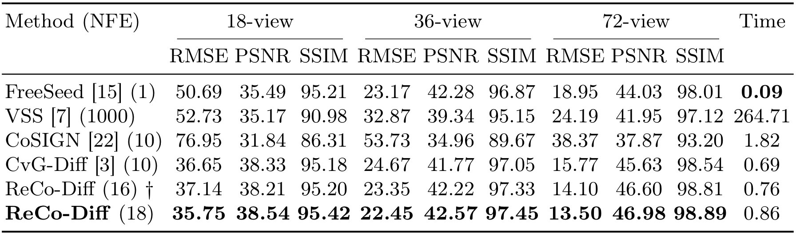
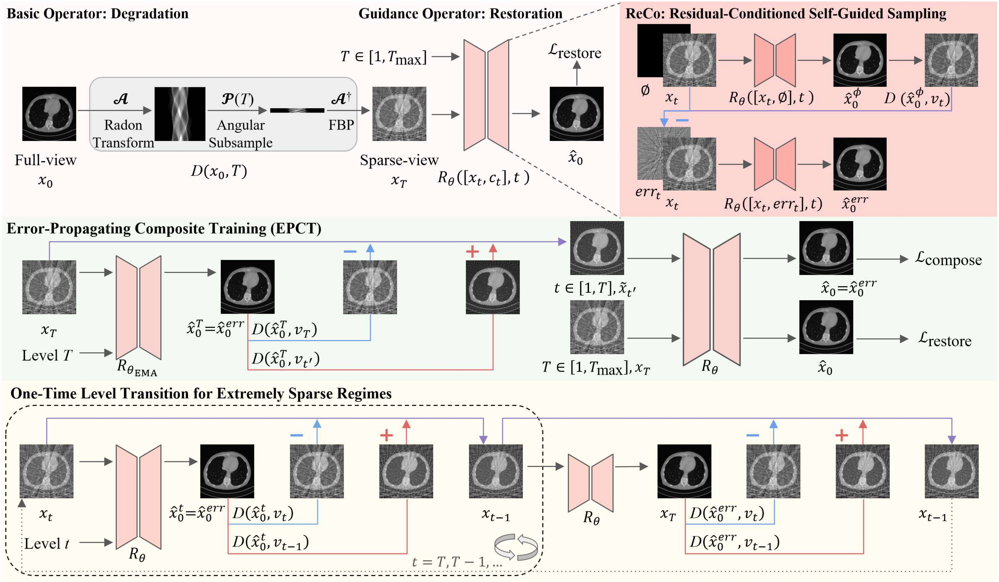
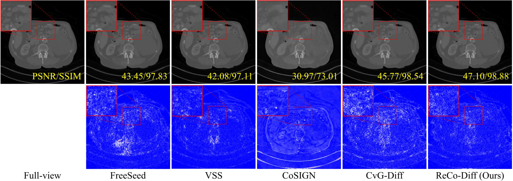
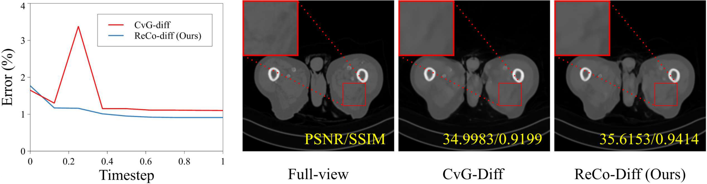

# ReCo-Diff
[](https://arxiv.org/abs/2603.02691)

ReCo-Diff: Residual-Conditioned Deterministic Sampling for Cold Diffusion in Sparse-View CT

---

## 🔷 Highlights — ReCo-Diff




- **Residual-Conditioned Deterministic Diffusion**  
  ReCo-Diff introduces residual-conditioned self-guided sampling that explicitly enforces residual consistency during cold diffusion. By directly conditioning on observation residuals, the model stabilizes multi-step reconstruction without relying on heuristic reset strategies.

- **Stable Reconstruction Under Severe Sparsity**  
  The proposed method suppresses error accumulation across sampling steps and maintains consistently lower timestep-wise error trajectories, particularly in extremely sparse-view settings (e.g., 18 views).

- **Unified Model Without Fine-Tuning**  
  A single trained model supports multiple target view configurations (18 / 36 / 72 views) without additional fine-tuning, demonstrating robustness and practical applicability across varying sparsity levels.

## 📦 Requirements

- Create a new virtual environment and install the required libraries using `requirements.txt`.

```shell
git clone https://github.com/choiyoungeunn/ReCo-Diff.git
cd ReCo-Diff
conda create -n recodiff python=3.7
conda activate recodiff
pip install -r ./requirements.txt
```


### 🔧 Install torch-radon

- torch-radon is required for simulating DRRs and geometry utils. Install torch-radon by:
1. Download torch-radon from [torch-radon](https://github.com/matteo-ronchetti/torch-radon)
     ```shell
     git clone https://github.com/matteo-ronchetti/torch-radon.git
     ```
2. Due to some out-dated Pytorch function in torch-radon, modify code by running
     ```shell
     cd torch-radon
     patch -p1 < path/to/ReCo-Diff/torch-radon_fix/torch-radon_fix.patch
     ```
3. Install torch-radon by running
     ```shell
     python setup.py install
     ```

---

## 📊 Dataset

- Download the [AAPM dataset](https://aapm.app.box.com/s/eaw4jddb53keg1bptavvvd1sf4x3pe9h/folder/144226105715).
- After downloading, run preprocessing with `./datasets/preprocess_aapm.py`.
- Provide dataset paths directly in each script before running.

```shell
python ./datasets/preprocess_aapm.py
```

- Provide dataset paths directly in each script before running.

### Dataset Structure

Organize the dataset directory as follows:

```text
<aapm16 data root>/
├── train_img/
│   ├── L067_FD_1_1.CT.0001.0001.2015.12.22.18.09.40.840353.358074219.npy
│   ├── L067_FD_1_1.CT.0001.0002.2015.12.22.18.09.40.840353.358074243.npy
│   └── ...
└── test_img/
    ├── L506_FD_1_1.CT.0002.0001.2015.12.22.20.19.52.894480.358589814.npy
    ├── L506_FD_1_1.CT.0002.0002.2015.12.22.20.19.52.894480.358589838.npy
    └── ...
```
---

## 💾 Pretrained Checkpoint

Download a [checkpoint](https://drive.google.com/drive/folders/17G5z6vLXAuA5GYvGJTbSP1kEAVBPt6mh?usp=sharing) and use it for testing.

### Checkpoint Structure

```
ReCo-Diff ckpt/
└── ReCo-Diff-net-colddiff_best_epoch.pkl  
```

---

## 🚀 Train (ReCo-Diff)

- Script: `recodiff_train.sh`
- Set `res_dir` and `dataset_path` at the top of the file, then run:

```shell
bash recodiff_train.sh
```

---

## 🧪 Test (ReCo-Diff)

### Single checkpoint

- Script: `recodiff_test.sh`
- Set `res_dir`, `dataset_path`, and `net_checkpath_default` at the top of the file, then run:

```shell
bash recodiff_test.sh
```

### All checkpoints in a directory

- Script: `recodiff_test_ALL_search.sh`
- Set `ckpt_dir` at the top of the file, then run:

```shell
bash recodiff_test_ALL_search.sh
```

---

## 📈 Results







---

## 📚 Citation

If you find our paper helps you, please kindly cite our paper in your publications.

```bibtex
@misc{choi2026recodiffresidualconditioneddeterministicsampling,
      title={ReCo-Diff: Residual-Conditioned Deterministic Sampling for Cold Diffusion in Sparse-View CT}, 
      author={Yong Eun Choi and Hyoung Suk Park and Kiwan Jeon and Hyun-Cheol Park and Sung Ho Kang},
      year={2026},
      eprint={2603.02691},
      archivePrefix={arXiv},
      primaryClass={cs.CV},
      url={https://arxiv.org/abs/2603.02691}, 
}
```

---

## 🙏 Acknowledge

Our code is built upon [CvG-Diff](https://github.com/xmed-lab/CvG-Diff?tab=readme-ov-file).  
We sincerely thank the authors for generously sharing their code.
